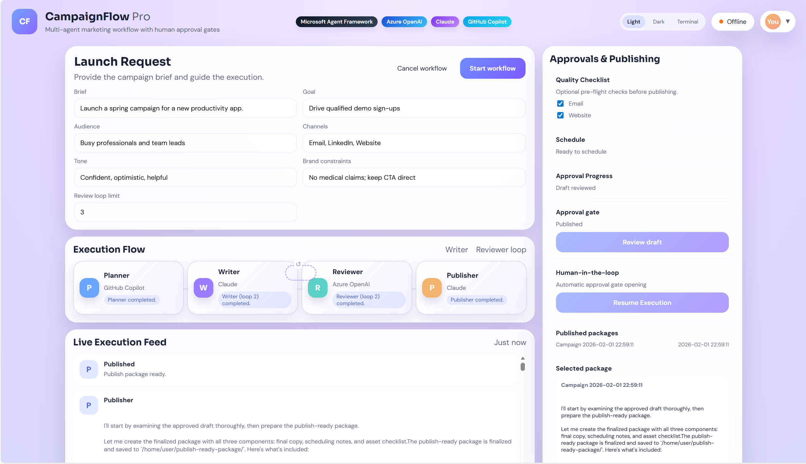
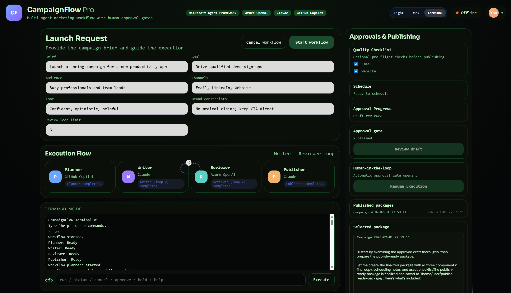

# CampaignFlow Studio - Human-First Marketing at Scale

CampaignFlow Studio is a multi-agent marketing workflow demo that combines Azure OpenAI, Claude, and GitHub Copilot agents, orchestrated by Microsoft Agent Framework. It features a writer-reviewer loop, human-in-the-loop escalation, and a final approval gate before publishing.





## Highlights
- Multi-agent orchestration (Planner -> Writer <-> Reviewer -> Publisher)
- Human-in-the-loop intervention when the review loop stalls
- Final approval gate before publishing
- Real-time execution stream with a modern React UI
- Pluggable agent backends (GitHub Copilot, Claude, Azure OpenAI)

## Workflow (ASCII)

[Planner - GitHub Copilot]
        |
        v
[Writer - Claude] <----> [Reviewer - Azure OpenAI]
        |                 ^
        |                 |
        +------(Human feedback if loop stalls)-----+
        |
        v
[Publisher - Claude]
        |
        v
[Human Approval Gate] -> Publish Package

## Tech Stack
- Backend: FastAPI + Microsoft Agent Framework (Python)
- Agents: GitHub Copilot SDK, Claude Agent SDK, Azure OpenAI Agent
- Frontend: React (CDN) + custom CSS

## Requirements
- Python 3.10+
- Node is NOT required (React loads from CDN)
- Agent SDKs (installed via pip)
- Credentials for GitHub Copilot, Claude, and Azure OpenAI

## Setup

1) Create a virtual environment and install dependencies:

```
cd backend
python -m venv .venv
.\.venv\Scripts\activate
pip install -r requirements.txt
```

2) Copy the sample environment file:

```
copy .env.sample .env
```

3) Configure credentials in `.env`:
- Add your real credentials for GitHub Copilot, Claude, and Azure OpenAI

4) Start the Claude worker (required for Writer + Publisher). Start this first:

```
python backend/claude_worker.py
```

5) Start the backend:

```
python -m backend.app
```

6) Open the UI:

```
http://127.0.0.1:8008
```

## Agent Mapping
- Planner: GitHub Copilot SDK (Agent Framework integration)
- Writer: Claude Agent SDK
- Reviewer: Azure OpenAI Agent (Agent Framework integration)
- Publisher: Claude Agent SDK

## Credential Notes
- GitHub Copilot SDK: Requires GitHub Copilot authentication
- Claude Agent SDK: Requires Claude Code CLI installed and authenticated
- Azure OpenAI: Requires endpoint, deployment name, and API key

## Design Notes
- The Writer and Reviewer loop until the draft is approved or the loop limit is reached.
- When the loop limit is exceeded, the UI requests human feedback.
- A final approval gate is required before the Publisher generates a release package.

## Architecture Note: Claude Worker
Claude is run in a separate worker process (`backend/claude_worker.py`) instead of inside the main FastAPI process. This avoids Windows event-loop subprocess limitations when the Claude SDK launches the `claude` CLI via `anyio.open_process`. The worker uses the default Windows Proactor event loop (subprocess-capable), while the FastAPI app uses the selector loop needed by uvicorn. This keeps the API responsive and makes Claude startup reliable on Windows.

## References
- GitHub Copilot SDK with Microsoft Agent Framework
- Claude Agent SDK with Microsoft Agent Framework
- Microsoft Agent Framework documentation
